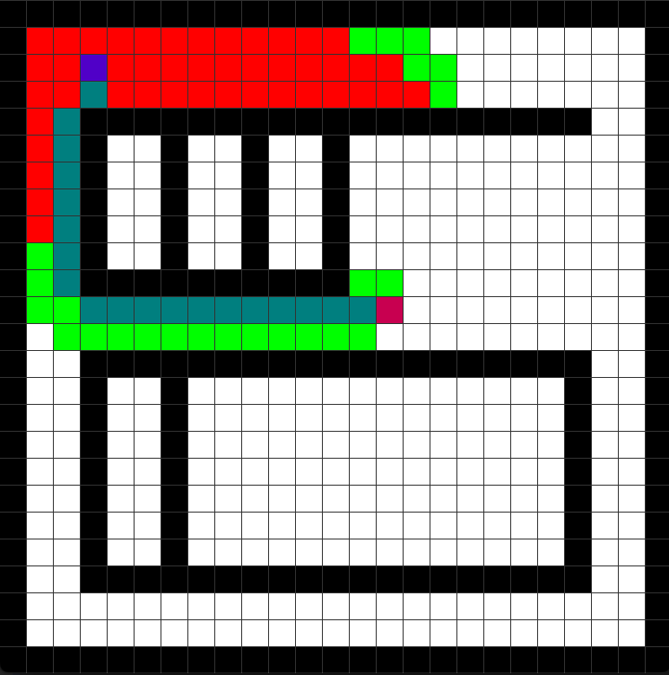

# AStarPathfinding
A* pathfinding algorithm implemented in processing with a visualization.

Modifible test map included as a txt file. Click one square to mark a start point and another to mark an end point, and the program will automatically navigate from one to another, and display its path and search area.

Green cells indicate candidate search cells who have not yet been chosen. Red cells indicate candidate search cells which were chosen at least once. The blue color indicates the final calculated path.

